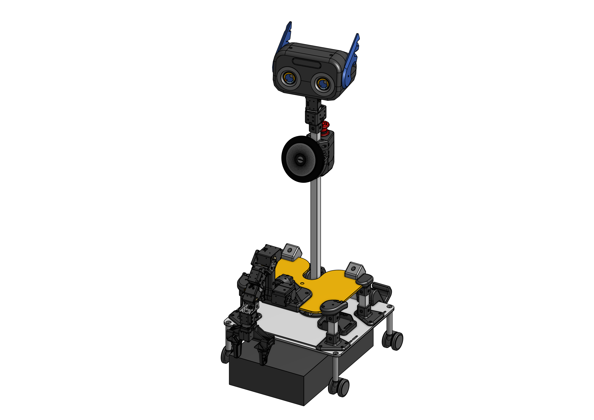
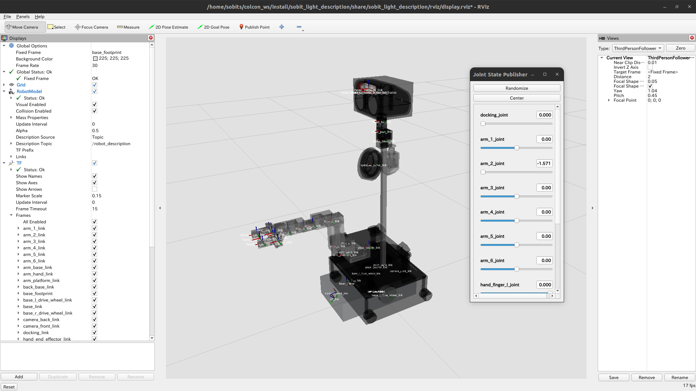

<a name="readme-top"></a>

[JA](README.md) | [EN](README.en.md)

[![Contributors][contributors-shield]][contributors-url]
[![Forks][forks-shield]][forks-url]
[![Stargazers][stars-shield]][stars-url]
[![Issues][issues-shield]][issues-url]
[![License][license-shield]][license-url]

# SOBIT LIGHT

<!-- 目次 -->
<details>
  <summary>目次</summary>
  <ol>
    <li>
      <a href="#概要">概要</a>
    </li>
    <li>
      <a href="#環境構築">環境構築</a>
      <ul>
        <li><a href="#環境条件">環境条件</a></li>
        <li><a href="#インストール方法">インストール方法</a></li>
      </ul>
    </li>
    <li>
    　<a href="#実行操作方法">実行・操作方法</a>
      <ul>
        <li><a href="#移動機構のみを使用する場合">移動機構のみを使用する場合</a></li>
        <li><a href="#Rviz上の可視化">Rviz上の可視化</a></li>
      </ul>
    </li>
    <li>
    　<a href="#ソフトウェア">ソフトウェア</a>
      <ul>
        <li><a href="#ジョイントコントローラ">ジョイントコントローラ</a></li>
        <li><a href="#ホイルコントローラ">ホイルコントローラ</a></li>
      </ul>
    </li>
    <li>
    　<a href="#ハードウェア">ハードウェア</a>
      <ul>
        <li><a href="#パーツのダウンロード方法">パーツのダウンロード方法</a></li>
        <li><a href="#電子回路図">電子回路図</a></li>
        <li><a href="#ロボットの組み立て">ロボットの組み立て</a></li>
        <li><a href="#ロボットの特徴">ロボットの特徴</a></li>
        <li><a href="#部品リストBOM">部品リスト（BOM）</a></li>
      </ul>
    </li>
    <li><a href="#マイルストーン">マイルストーン</a></li>
    <!-- <li><a href="#contributing">Contributing</a></li> -->
    <!-- <li><a href="#license">License</a></li> -->
    <li><a href="#参考文献">参考文献</a></li>
  </ol>
</details>


<!-- レポジトリの概要 -->
## 概要



SOBITSが開発した[カチャカ](https://kachaka.life/home/)を用いたモバイルマニピュレータ（SOBIT LIGHT）を動かすためのライブラリです．

> [!WARNING]
> 初心者の場合，実機のロボットを扱う際に，先輩方に付き添ってもらいながらロボットを動かしましょう．

<p align="right">(<a href="#readme-top">上に戻る</a>)</p>


<!-- セットアップ -->
## セットアップ

ここで，本レポジトリのセットアップ方法について説明します．

<p align="right">(<a href="#readme-top">上に戻る</a>)</p>


### 環境条件

まず，以下の環境を整えてから，次のインストール段階に進んでください．

| System  | Version |
| --- | --- |
| Ubuntu | 22.04 (Jammy Jellyfish) |
| ROS    | Humble Hawksbill |
| Python | 3.10 |

> [!NOTE]
> `Ubuntu`や`ROS`のインストール方法に関しては，[SOBITS Manual](https://github.com/TeamSOBITS/sobits_manual#%E9%96%8B%E7%99%BA%E7%92%B0%E5%A2%83%E3%81%AB%E3%81%A4%E3%81%84%E3%81%A6)に参照してください．

<p align="right">(<a href="#readme-top">上に戻る</a>)</p>


### インストール方法

1. ROSの`src`フォルダに移動します．
   ```sh
   $ cd ~/colcon_ws/src/
   ```
2. 本レポジトリをcloneします．
   ```sh
   $ git clone https://github.com/TeamSOBITS/sobit_light
   ```
3. レポジトリの中へ移動します．
   ```sh
   $ cd sobit_light/
   ```
4. 依存パッケージをインストールします．
   ```sh
   $ bash install.sh
   ```
5. パッケージをコンパイルします．
   ```sh
   $ cd ~/colcon_ws/
   $ colcon build --symlink-install
   $ source ~/colcon_ws/install/setup.sh
   ```

<p align="right">(<a href="#readme-top">上に戻る</a>)</p>


<!-- 実行・操作方法 -->
## 実行・操作方法

1. SOBIT LIGHTの起動する機能をパラメタとして[minimal.launch](sobit_light_bringup/launch/minimal.launch)に設定します．
   ```xml
    <!-- Activate Mobile-Base (true), Arm (true), Head (true) -->
    <arg name="enable_mb"           default="true"/>
    <arg name="enable_arm"          default="true"/>
    <arg name="enable_head"         default="true"/>
    ...
    <arg name="open_rviz"           default="true"/>
    ...
   ```

> [!NOTE]
> 使用したい機能に応じて，`true`か`false`かに書き換えてください．

2. [minimal.launch](sobit_light_bringup/launch/minimal.launch)というlaunchファイルを実行します．
   ```sh
   $ roslaunch sobit_light_bringup minimal.launch
   ```
3. [任意] デモプログラムを実行してみましょう．
   ```sh
   $ rosrun sobit_light_library test_control_wheel.py
   ```

> [!NOTE]
> SOBIT LIGHTの動作方法に慣れるため，[example](sobit_light_library/example/)フォルダを確認し，それぞれのサンプルファイルから動作関数を学びましょう．

<p align="right">(<a href="#readme-top">上に戻る</a>)</p>


### 移動機構のみを使用する場合

SOBIT LIGHTの移動機構単体で動かすことができます．

1. TODO!: [minimal.launch](sobit_light_bringup/launch/minimal.launch.py)の設定を次にように書き換えます．
    ```xml
    <!-- Activate Mobile-Base (true), Arm (true), Head (true) -->
    <arg name="enable_mb"           default="true"/>
    <arg name="enable_arm"          default="false"/>
    <arg name="enable_head"         default="false"/>

    <!-- URG: lan-cable (true), usb-cable (false) -->
    <arg name="urg_lan"             default="false"/>
    ...
    ```
2. [minimal.launch](sobit_light_bringup/launch/minimal.launch.py)というlaunchファイルを実行します．
    ```sh
    $ ros2 launch sobit_light_bringup minimal.launch
    ```
3. [任意] デモプログラムを実行してみましょう．
    ```sh
    $ ros2 run sobit_light_library_python sobit_light_wheel_controller.py
    ```

<!-- > [!NOTE] -->
<!-- > URG(LiDAR)はLAN式通信の場合は`true`に，USB式通信の場合は`false`に設定してください． -->

<p align="right">(<a href="#readme-top">上に戻る</a>)</p>


### Rviz2上の可視化

実機を動かす前段階として，Rviz2上でSOBIT LIGHTを可視化し，ロボットの構成を表示することができます．

```sh
$ ros2 launch sobit_light_description display.launch.py
```

正常に動作した場合は，次のようにRvizが表示されます．


<p align="right">(<a href="#readme-top">上に戻る</a>)</p>


## ソフトウェア

<details>
<summary>SOBIT LIGHTと関わるソフトの情報まとめ</summary>


### ジョイントコントローラ

SOBIT LIGHTのパンチルト機構とマニピュレータを動かすための情報まとめです．

<p align="right">(<a href="#readme-top">上に戻る</a>)</p>


#### 動作関数

1.  `moveToPose()` : 決められたポーズに動かします．
    ```cpp
    bool moveToPose(
        const std::string& pose_name,               // ポーズ名
        const double sec = 5.0                      // 動作時間 [s]
        bool is_sleep = true                        // 回転後に待機するかどうか
    );
    ```

> [!NOTE]
> 既存のポーズは[sobit_light_pose.yaml](sobit_light_library/config/sobit_light_pose.yaml)に確認できます．ポーズの作成方法については[ポーズの設定方法](#ポーズの設定方法)をご参照ください．

2.  `moveAllJointsRad()` : すべてのジョイントを任意の角度に動かします．
    ```cpp
    bool sobit::SobitProJointController::moveAllJointsRad (
        const double arm_shoulder_pitch_joint,       // 回転角度 [rad]
        const double arm_elbow_upper_pitch_joint,    // 回転角度 [rad]
        const double arm_elbow_lower_pitch_joint,    // 回転角度 [rad]
        const double arm_elbow_lower_yaw_joint,     // 回転角度 [rad]
        const double arm_wrist_pitch_joint,          // 回転角度 [rad]
        const double hand_joint,                    // 回転角度 [rad]
        const double head_yaw_joint,                // 回転角度 [rad]
        const double head_pitch_joint,               // 回転角度 [rad]
        const double sec = 5.0,                     // 回転時間 [s]
        bool is_sleep = true                        // 回転後に待機するかどうか
    );
    ```

3.  `moveJointRad()` : 指定されたジョイントを任意の角度に動かします．
    ```cpp
    bool sobit::SobitProJointController::moveJointRad (
        const Joint joint_num,                      // ジョイント名 (定数名)
        const double rad,                           // 回転角度 [rad]
        const double sec = 5.0,                     // 回転時間 [s]
        bool is_sleep = true                        // 回転後に待機するかどうか
    );
    ```

> [!NOTE]
> `ジョイント名`は[ジョイント名](#ジョイント名)をご確認ください．
 
4.  `moveArmRad()` : アームの関節を任意の角度に動かします．
    ```cpp
    bool sobit::SobitProJointController::moveArmRad(
        const double arm_shoulder_pitch_joint,       // 回転角度 [rad]
        const double arm_elbow_upper_pitch_joint,    // 回転角度 [rad]
        const double arm_elbow_lower_pitch_joint,    // 回転角度 [rad]
        const double arm_elbow_lower_yaw_joint,     // 回転角度 [rad]
        const double arm_wrist_pitch_joint,          // 回転角度 [rad]
        const double sec = 5.0,                     // 回転時間 [s]
        bool is_sleep = true                        // 回転後に待機するかどうか
    );
    ```

5.  `moveHeadRad()` : パンチルト機構を任意の角度に動かす．
    ```cpp
    bool sobit::SobitProJointController::moveHeadRad(
        const double head_camera_pan,               // 回転角度 [rad]
        const double head_camera_tilt,              // 回転角度 [rad]
        const double sec = 5.0,                     // 移動時間 [s]
        bool is_sleep = true                        // 回転後に待機するかどうか
    );
    ```

6.  `moveHandToTargetCoord()` : ハンドをxyz座標に動かします（把持モード）．
    ```cpp
    bool sobit::SobitProJointController::moveHandToTargetCoord(
        const double target_pos_x,                  // 把持目的地のx [m]
        const double target_pos_y,                  // 把持目的地のy [m]
        const double target_pos_z,                  // 把持目的地のz [m]
        const double shift_x,                       // xyz座標のx軸をシフトする [m]
        const double shift_y,                       // xyz座標のy軸をシフトする [m]
        const double shift_z                        // xyz座標のz軸をシフトする [m]
        const double sec = 5.0,                     // 移動時間 [s]
        bool is_sleep = true                        // 回転後に待機するかどうか
    );
    ```

7.  `moveHandToTargetTF()` : ハンドをtf名に動かします（把持モード）．
    ```cpp
    bool sobit::SobitProJointController::moveHandToTargetTF(
        const std::string& target_name,             // 把持目的tf名
        const double shift_x,                       // xyz座標のx軸をシフトする [m]
        const double shift_y,                       // xyz座標のy軸をシフトする [m]
        const double shift_z                        // xyz座標のz軸をシフトする [m]
        const double sec = 5.0,                     // 移動時間 [s]
        bool is_sleep = true                        // 回転後に待機するかどうか
    );
    ```

8.  `moveHandToPlaceCoord()` : ハンドをxyz座標に動かします（配置モード）．
    ```cpp
    bool sobit::SobitProJointController::moveHandToPlaceCoord(
        const double target_pos_x,                  // 配置目的地のx [m]
        const double target_pos_y,                  // 配置目的地のy [m]
        const double target_pos_z,                  // 配置目的地のz [m]
        const double shift_x,                       // xyz座標のx軸をシフトする [m]
        const double shift_y,                       // xyz座標のy軸をシフトする [m]
        const double shift_z                        // xyz座標のz軸をシフトする [m]
        const double sec = 5.0,                     // 移動時間 [s]
        bool is_sleep = true                        // 回転後に待機するかどうか
    ); 
    ```

9.  `moveHandToPlaceTF()` : ハンドをtf名に動かします（配置モード）．
    ```cpp
    bool sobit::SobitProJointController::moveHandToPlaceTF(
        const std::string& target_name,             // 配置目的tf名
        const double shift_x,                       // xyz座標のx軸をシフトする [m]
        const double shift_y,                       // xyz座標のy軸をシフトする [m]
        const double shift_z                        // xyz座標のz軸をシフトする [m]
        const double sec = 5.0,                     // 移動時間 [s]
        bool is_sleep = true                        // 回転後に待機するかどうか
    );
    ```

10.  `graspDecision()` : ハンドに流れる電流値に応じて，把持判定が決まります．
    ```cpp
    bool sobit::SobitProJointController::graspDecision(
        const int min_curr = 300,                   // 最小電流値
        const int max_curr = 1000                   // 最大電流値
    );
    ```

11.  `placeDecision()` : ハンドに流れる電流値に応じて，配置判定が決まります．
    ```cpp
    bool sobit::SobitProJointController::placeDecision(
        const int min_curr = 500,                   // 最小電流値
        const int max_curr = 1000                   // 最大電流値
    );
    ```

<p align="right">(<a href="#readme-top">上に戻る</a>)</p>


#### ジョイント名

SOBIT LIGHTのジョイント名とその定数名を以下の通りです．

| ジョイント番号 | ジョイント名 | ジョイント定数名 |
| :---: | --- | --- |
| 0 | arm_shoulder_roll_joint | kArmShoulderRollJoint |
| 1 | arm_shoulder_pitch_joint | kArmShoulderPitchJoint |
| 2 | arm_shoulder_pitch_sub_joint | kArmShoulderPitchSubJoint |
| 3 | arm_elbow_pitch_joint | kArmElbowPitchJoint |
| 4 | arm_forearm_roll_joint | kArmForearmRollJoint |
| 5 | arm_wrist_pitch_joint | kArmWristPitchJoint |
| 6 | arm_wrist_roll_joint | kArmWristRollJoint |
| 7 | hand_joint | kHandJoint |
| 8 | head_yaw_joint | kHeadYawJoint |
| 9 | head_pitch_joint | kHeadPitchJoint |

<p align="right">(<a href="#readme-top">上に戻る</a>)</p>


#### ポーズの設定方法

TODO!

[sobit_light_pose.yaml](sobit_light_library_python/config/pose_list.yaml)というファイルでポーズの追加・編集ができます．以下のようなフォーマットになります．

```yaml
sobit_light_pose:
    - { 
        pose_name: "pose_name",
        arm_shoulder_1_pitch_joint: 1.57,
        arm_elbow_upper_1_pitch_joint: 1.57,
        arm_elbow_lower_pitch_joint: 0.0,
        arm_elbow_lower_yaw_joint: -1.57,
        arm_wrist_pitch_joint: -1.57,
        hand_joint: 0.0,
        head_yaw_joint: 0.0,
        head_pitch_joint: 0.0
    }
    ...
```  

### ホイールコントローラ

SOBIT LIGHTの移動機構を動かすための情報まとめです．

<p align="right">(<a href="#readme-top">上に戻る</a>)</p>


#### 動作関数

1.  `controlWheelLinear()` : 並進（直進移動・斜め移動・横移動）に移動させます．
    ```cpp
    bool sobit::SobitProWheelController::controlWheelLinear (
        const double distance_x,                    // x方向への直進移動距離 [m]
        const double distance_y,                    // y方向への直進移動距離 [m]
    )
    ```  
2.  `controlWheelRotateRad()` : 回転運動を行う(弧度法：Radian)
    ```cpp
    bool sobit::SobitProWheelController::controlWheelRotateRad (
        const double angle_rad,                     // 中心回転角度 [rad]
    )
    ```  
3.  `controlWheelRotateDeg()` : 回転運動を行う(度数法：Degree)
    ```cpp
    bool sobit::SobitProWheelController::controlWheelRotateDeg ( 
        const double angle_deg,                     // 中心回転角度 (deg)
    )
    ```

</details>

<p align="right">(<a href="#readme-top">上に戻る</a>)</p>


## ハードウェア
SOBIT LIGHTはオープンソースハードウェアとして[OnShape](https://cad.onshape.com/documents/1c0eb7c7c35643f91262c58d/w/47103fedd1427abad418bed6/e/d36ec26c38875fb78c5b29ac)にて公開しております．


<p align="right">(<a href="#readme-top">上に戻る</a>)</p>


<details>
<summary>ハードウェアの詳細についてはこちらを確認してください．</summary>

### パーツのダウンロード方法

1. Onshapeにアクセスしましょう．

> [!NOTE]
> ファイルをダウンロードするために，`OnShape`のアカウントを作成する必要はありません．ただし，本ドキュメント全体をコピーする場合，アカウントの作成を推薦します．

2. `Instances`の中にパーツを右クリックで選択します．
3. 一覧が表示され，`Export`ボタンを押してください．
4. 表示されたウィンドウの中に，`Format`という項目があります．`STEP`を選択してください．
5. 最後に，青色の`Export`ボタンを押してダウンロードが開始されます．

<p align="right">(<a href="#readme-top">上に戻る</a>)</p>


### 電子回路図

TBD

<p align="right">(<a href="#readme-top">上に戻る</a>)</p>


### ロボットの組み立て

TBD

<p align="right">(<a href="#readme-top">上に戻る</a>)</p>


### ロボットの特徴

TBD

| 項目 | 詳細 |
| --- | --- |

<!-- | 最大直進速度 | 0.7[m/s] |
| 最大回転速度 | 0.229[rad/s] |
| 最大ペイロード | 0.35[kg] |
| サイズ (長さx幅x高さ) | 450x450x1250[mm] |
| 重量 | 16[kg] |
| リモートコントローラ | PS3/PS4 |
| LiDAR | UST-20LX |
| RGB-D | Azure Kinect DK (頭部)，RealSense D405 (アーム) |
| IMU | LSM6DSMUS |
| スピーカー | モノラルスピーカー |
| マイク | コンデンサーマイク |
| アクチュエータ (アーム) | 2 x XM540-W150, 6 x XM430-W320 |
| アクチュエータ (移動機構) | 4 x XM430-W320, 4 x XM430-W210 |
| 電源 | 2 x Makita 6.0Ah 18V |
| PC接続 | USB | -->

<p align="right">(<a href="#readme-top">上に戻る</a>)</p>


### 部品リスト（BOM）

TBD

| 部品 | 型番 | 個数 | 購入先 |
| --- | --- | --- | --- |
| --- | --- | 1 | [link]() |
| --- | --- | 1 | [link]() |
| --- | --- | 1 | [link]() |
| --- | --- | 1 | [link]() |
| --- | --- | 1 | [link]() |
| --- | --- | 1 | [link]() |
| --- | --- | 1 | [link]() |
| --- | --- | 1 | [link]() |
| --- | --- | 1 | [link]() |
| --- | --- | 1 | [link]() |
| --- | --- | 1 | [link]() |
| --- | --- | 1 | [link]() |
| --- | --- | 1 | [link]() |


</details>

<p align="right">(<a href="#readme-top">上に戻る</a>)</p>


<!-- マイルストーン -->
## マイルストーン

- [x] OSS
    - [x] ドキュメンテーションの充実
    - [x] コーディングスタイルの統一
- Abundant update

現時点のバッグや新規機能の依頼を確認するために[Issueページ][issues-url] をご覧ください．

<p align="right">(<a href="#readme-top">上に戻る</a>)</p>


<!-- CONTRIBUTING -->
<!-- ## Contributing

Contributions are what make the open source community such an amazing place to learn, inspire, and create. Any contributions you make are **greatly appreciated**.

If you have a suggestion that would make this better, please fork the repo and create a pull request. You can also simply open an issue with the tag "enhancement".
Don't forget to give the project a star! Thanks again!

1. Fork the Project
2. Create your Feature Branch (`git checkout -b feature/AmazingFeature`)
3. Commit your Changes (`git commit -m 'Add some AmazingFeature'`)
4. Push to the Branch (`git push origin feature/AmazingFeature`)
5. Open a Pull Request

<p align="right">(<a href="#readme-top">上に戻る</a>)</p> -->


<!-- LICENSE -->
<!-- ## License

Distributed under the MIT License. See `LICENSE.txt` for more NOTErmation.

<p align="right">(<a href="#readme-top">上に戻る</a>)</p> -->


<!-- 参考文献 -->
## 参考文献

* [Kachaka API](https://github.com/pf-robotics/kachaka-api)
* [Dynamixel SDK](https://emanual.robotis.com/docs/en/software/dynamixel/dynamixel_sdk/overview/)
* [ROS Humble](https://docs.ros.org/en/humble/index.html)
* [ROS2 Control](https://control.ros.org/humble/index.html)
* [ROS2 Control Gazebo](https://github.com/ros-controls/gz_ros2_control)

<p align="right">(<a href="#readme-top">上に戻る</a>)</p>


<!-- MARKDOWN LINKS & IMAGES -->
<!-- https://www.markdownguide.org/basic-syntax/#reference-style-links -->
[contributors-shield]: https://img.shields.io/github/contributors/TeamSOBITS/sobit_light.svg?style=for-the-badge
[contributors-url]: https://github.com/TeamSOBITS/sobit_light/graphs/contributors
[forks-shield]: https://img.shields.io/github/forks/TeamSOBITS/sobit_light.svg?style=for-the-badge
[forks-url]: https://github.com/TeamSOBITS/sobit_light/network/members
[stars-shield]: https://img.shields.io/github/stars/TeamSOBITS/sobit_light.svg?style=for-the-badge
[stars-url]: https://github.com/TeamSOBITS/sobit_light/stargazers
[issues-shield]: https://img.shields.io/github/issues/TeamSOBITS/sobit_light.svg?style=for-the-badge
[issues-url]: https://github.com/TeamSOBITS/sobit_light/issues
[license-shield]: https://img.shields.io/github/license/TeamSOBITS/sobit_light.svg?style=for-the-badge
[license-url]: LICENSE
