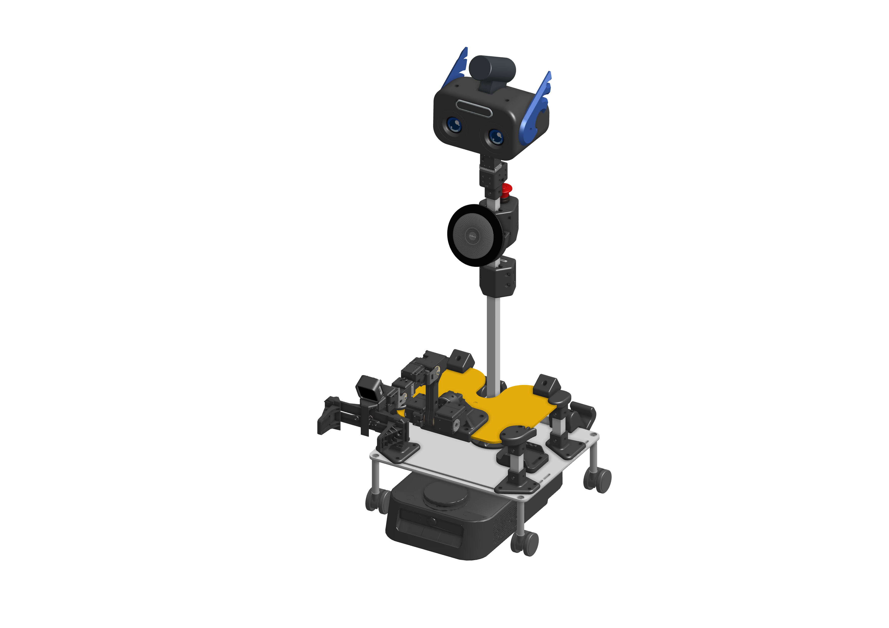
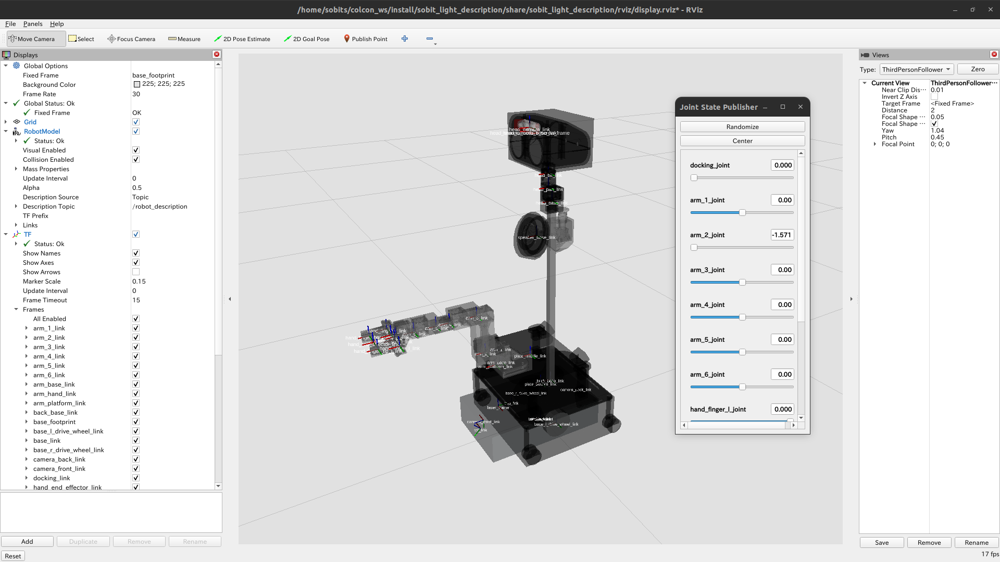
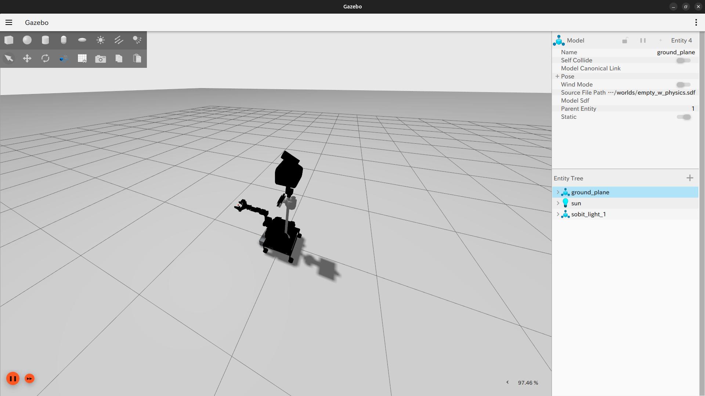
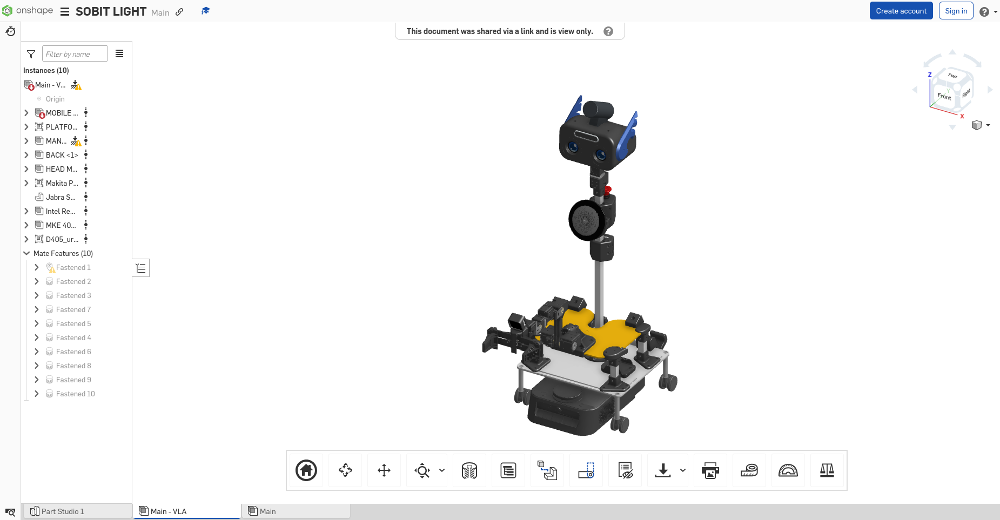
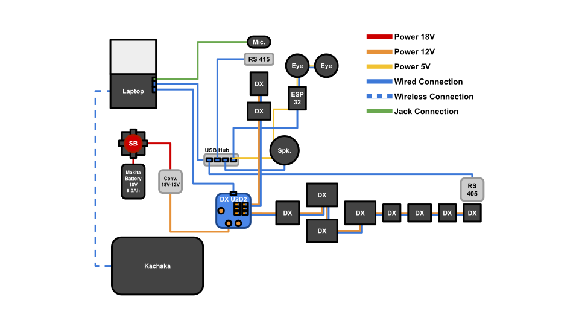

<a name="readme-top"></a>

[JA](README.md) | [EN](README_en.md)

[![Contributors][contributors-shield]][contributors-url]
[![Forks][forks-shield]][forks-url]
[![Stargazers][stars-shield]][stars-url]
[![Issues][issues-shield]][issues-url]
[![License][license-shield]][license-url]

# SOBIT LIGHT

<!-- 目次 -->
<details>
  <summary>目次</summary>
  <ol>
    <li>
      <a href="#概要">概要</a>
    </li>
    <li>
      <a href="#環境構築">環境構築</a>
      <ul>
        <li><a href="#環境条件">環境条件</a></li>
        <li><a href="#インストール方法">インストール方法</a></li>
      </ul>
    </li>
    <li>
    　<a href="#実行操作方法">実行・操作方法</a>
      <ul>
        <li><a href="#Rviz上の可視化">Rviz上の可視化</a></li>
        <li><a href="#シミュレータの実行方法">シミュレータの実行方法</a></li>
      </ul>
    </li>
    <li>
    　<a href="#ソフトウェア">ソフトウェア</a>
      <ul>
        <li><a href="#ジョイントコントローラ">ジョイントコントローラ</a></li>
        <li><a href="#ホイルコントローラ">ホイルコントローラ</a></li>
      </ul>
    </li>
    <li>
    　<a href="#ハードウェア">ハードウェア</a>
      <ul>
        <li><a href="#パーツのダウンロード方法">パーツのダウンロード方法</a></li>
        <li><a href="#電子回路図">電子回路図</a></li>
        <!-- <li><a href="#ロボットの組み立て">ロボットの組み立て</a></li> -->
        <li><a href="#ロボットの特徴">ロボットの特徴</a></li>
        <li><a href="#部品リストBOM">部品リスト（BOM）</a></li>
      </ul>
    </li>
    <li><a href="#マイルストーン">マイルストーン</a></li>
    <!-- <li><a href="#contributing">Contributing</a></li> -->
    <!-- <li><a href="#license">License</a></li> -->
    <li><a href="#参考文献">参考文献</a></li>
  </ol>
</details>


<!-- 概要 -->
## 概要



Preferred Robotics(c)が開発した[カチャカ](https://kachaka.life/home/)という移動機構を用いたSOBITS自作のモバイルマニピュレータを動かすためのライブラリです．

> [!CAUTION]
> 初心者の場合，実機のロボットを扱う際に，先輩方に付き添ってもらいながらロボットを動かしましょう．

<p align="right">(<a href="#readme-top">上に戻る</a>)</p>


<!-- セットアップ -->
## セットアップ

ここで，本レポジトリのセットアップ方法について説明します．

<p align="right">(<a href="#readme-top">上に戻る</a>)</p>


### 環境条件

まず，以下の環境を整えてから，次のインストール段階に進んでください．

| System  | Version |
| --- | --- |
| Ubuntu | 22.04 (Jammy Jellyfish) |
| ROS    | Humble Hawksbill |
| Python | 3.10 |
| Docker | latest |

> [!NOTE]
> `Ubuntu`や`ROS`のインストール方法に関しては，[SOBITS Manual](https://github.com/TeamSOBITS/sobits_manual#%E9%96%8B%E7%99%BA%E7%92%B0%E5%A2%83%E3%81%AB%E3%81%A4%E3%81%84%E3%81%A6)に参照してください．

<p align="right">(<a href="#readme-top">上に戻る</a>)</p>


### インストール方法

**SOBIT LIGHTを使用するローカル環境，またはコンテナ内でのセットアップ内容**
1. ROSの`src`フォルダに移動します．
    ```sh
    $ cd ~/colcon_ws/src/
    ```

2. 本レポジトリをcloneします．
    ```sh
    $ git clone https://github.com/TeamSOBITS/sobit_light
    ```

3. レポジトリの中へ移動します．
    ```sh
    $ cd sobit_light/
    ```

4. 依存パッケージをインストールします．
    ```sh
    $ bash install.sh
    ```

5. パッケージをコンパイルします．
    ```sh
    $ cd ~/colcon_ws/
    $ colcon build --symlink-install
    $ source ~/colcon_ws/install/setup.sh
    ```

**ローカル環境でのセットアップ内容**
1. Kachaka APIのリポジトリをcloneします．
    ```sh
    $ cd ~/
    $ git clone https://github.com/TeamSOBITS/kachaka-api
    ```

2. 最新のDockerイメージをビルドします．
    ```sh
    $ cd kachaka-api/
    $ docker buildx build -t kachaka-api --target kachaka-grpc-ros2-bridge -f Dockerfile.ros2 . --build-arg BASE_ARCH=x86_64 --load
    ```

3. `ROS_DOMAIN_ID`と`RMW_IMPLEMENTATION`を設定します．一例として，IDを`10`とします．
    ```sh
    $ echo 'export ROS_DOMAIN_ID=10' >> ~/.bashrc
    $ echo 'export RMW_IMPLEMENTATION=rmw_cyclonedds_cpp' >> ~/.bashrc
    $ source ~/.bashrc
    ```

> [!IMPORTANT]
> データ通信のため，ローカル環境以外(Docker等)でROSのワークスペースを使用している場合は，`ROS_DOMAIN_ID`の値を統一させる必要があることを忘れないでください．

4. KachakaのIPアドレスを確認します．
    1. ひとつの方法は，Kachakaに「ねぇカチャカ、IPアドレスを教えて」と話しかけることです．KachakaがIPアドレスを読み上げてくれます．
    2. もうひとつの方法は，Kachakaアプリの「`設定`」タブを開き，「`設定・情報`」カテゴリの「`アプリ情報`」をタップし，「`カチャカ`」カテゴリ内の「`IPアドレス`」欄を確認することです．

5. KachakaとのROS Bridgeを簡単に立ち上げられるようにするために，`alias`を設定します．
    ```sh
    $ echo 'alias kachaka="bash ~/kachaka-api/tools/ros2_bridge/start_bridge.sh"' >> ~/.bashrc
    $ source ~/.bashrc
    ```

<p align="right">(<a href="#readme-top">上に戻る</a>)</p>


<!-- 実行・操作方法 -->
## 実行・操作方法

1. [ローカル環境] KachakaとのROS BridgeのDockerコンテナを立ち上げます．
    ```
    $ kachaka <カチャカのIPアドレス> sobit_light no
    ```
> [!NOTE]
> `sobit_light`を書くことによって，ロボットの`namespace`を設定しています．また，`no`では，Kachaka側のrobot_descriptionの発行を停止させます．詳細については，[Dockerを使ったros2_bridgeの起動](https://github.com/TeamSOBITS/kachaka-api/blob/main/docs/ROS2.md#%E3%83%96%E3%83%AA%E3%83%83%E3%82%B8%E3%81%AE%E8%B5%B7%E5%8B%95)を確認してください．

> [!WARNING]
> KachakaのIPが変わる可能性がありますので，ご注意ください．

2. SOBIT LIGHTをインストールしている環境内で[real_minimal.launch](sobit_light_bringup/launch/real_minimal.launch.py)というlaunchファイルを実行します．
   ```sh
   $ ros2 launch sobit_light_bringup real_minimal.launch.py
   ```

ロボットが立ち上がらない・Kachakaとの通信ができていない場合は，次の項目を確認してください．
- 緊急停止ボタンが押下されていないか．
- バッテリが十分に充電されているか ．
- USB hubがパソコンと接続されているか．
- [TODO] Dynamixel Dongleの名前は`/dev/ttyUSB0`なのか．
- - 確認するために`$ ls /dev`を書いて，`/dev/ttyUSB1`が表示される場合，[controllers.urdf.xacro](sobit_light_description/urdf/controllers.urdf.xacro)の`usb_port`を更新してください．
- Kachaka IPが正しいか．
- `ROS_DOMAIN_ID`がカチャカ側と開発環境側と同じか．

<p align="right">(<a href="#readme-top">上に戻る</a>)</p>

### Rviz2上の可視化

実機を動かす前段階として，Rviz2上でSOBIT LIGHTを可視化し，ロボットの構成を表示することができます．

```sh
$ ros2 launch sobit_light_description display.launch.py
```

正常に動作した場合は，次のようなRviz画面が表示されます．


<p align="right">(<a href="#readme-top">上に戻る</a>)</p>

### シミュレータの実行方法

SOBIT LIGHTにはGazebo Ignitionのシミュレーション環境が用意されておりますので，実機がなくても，動作確認が可能です．

```sh
$ ros2 launch sobit_light_bringup gz_minimal.launch.py
```

正常に動作した場合は，次のようなGazeboの画面が表示されます．


> [!TIP]
> 実機と同じようなセンサも搭載されていますので，パソコンによって処理が重くなる可能性がありますので，必要なセンサだけを[gz_minimal.launch.py](sobit_light_bringup/launch/gz_minimal.launch.py)で選択してください．

```python
'enable_gz_front_cam_color' : 'True',
'enable_gz_back_cam_color'  : 'True',
'enable_gz_head_cam_color'  : 'True',
'enable_gz_head_cam_depth'  : 'True',
'enable_gz_hand_cam_color'  : 'True',
'enable_gz_hand_cam_depth'  : 'True',
'enable_gz_lidar'           : 'True',
'enable_gz_imu'             : 'True',
```

また，複数のSOBIT LIGHTを同じシミュレーション環境でも出現できます．
そのために，[gz_minimal.launch.py](sobit_light_bringup/launch/gz_minimal.launch.py)でロボットの数に合わせて`gz_robot.launch.py`が実行されるようにその設定を加えてください．

`robot_name`はロボット間で異なる値を持つ必要があります．
さらに，`robot_coords_x`，`robot_coords_y`，および`robot_coords_z`でロボットの出現座標を変更できます．

一例はこちらとなります．
```python
...
# Launch Robot No. 1
IncludeLaunchDescription(
    PythonLaunchDescriptionSource([
        PathJoinSubstitution([
            FindPackageShare('sobit_light_bringup'),
            'launch',
            'robot.launch.py'
        ])
    ]),
    launch_arguments={
        'robot_name': 'sobit_light_1',
        'robot_coords_x': '0', # x 
        'robot_coords_y': '0', # y
        'robot_coords_Y': '0', # yaw
        ...
    }.items()
),
# Launch Robot No. 2
IncludeLaunchDescription(
    PythonLaunchDescriptionSource([
        PathJoinSubstitution([
            FindPackageShare('sobit_light_bringup'),
            'launch',
            'gz_robot.launch.py'
        ])
    ]),
    launch_arguments={
        'robot_name': 'sobit_light_2',
        'robot_coords_x': '0', # x 
        'robot_coords_y': '2', # y
        'robot_coords_Y': '0', # yaw
        ...
    }.items()
),
...
```

<p align="right">(<a href="#readme-top">上に戻る</a>)</p>


## ソフトウェア

<details>
<summary>SOBIT LIGHTと関わるソフトの情報まとめ</summary>


### ジョイントコントローラ

SOBIT LIGHTのパンチルト機構とマニピュレータを動かすための情報まとめです．

<p align="right">(<a href="#readme-top">上に戻る</a>)</p>


#### 動作方法

1. `move_to_pose` : 決められたポーズに動かします．
    ```yaml
    # MoveToPose.action
    # Goal
    string pose_name                                # Target pose name
    builtin_interfaces/Duration time_allowance      # Target time length
    ---
    # Result
    bool success                                    # Success / Failure
    string message                                  # Result message
    builtin_interfaces/Duration total_elapsed_time  # Finished time length
    ---
    # Feedback
    string[] current_joint_names                    # Currently moving joint name(s)
    float32[] current_joint_rad                     # Currently moving joint position(s)
    # float32[] current_joint_vel                   # Currently moving joint velocity(s)
    builtin_interfaces/Duration move_time           # Elapsed time length
    ```

> [!NOTE]
> 既存のポーズは[pose_list.yaml](sobit_light_library/config/pose_list.yaml)に確認できます．ポーズの作成方法については[ポーズの設定方法](#ポーズの設定方法)をご参照ください．

2. `move_joint` : 指定されたジョイント(複数でも可)を任意の角度に動かします．
    ```yaml
    # MoveJoint.action
    # Goal
    string[] target_joint_names                     # Target joint name(s)
    float64[] target_joint_rad                      # Target joint position(s)
    builtin_interfaces/Duration time_allowance      # Target time length
    ---
    # Result
    bool success                                    # Success / Failure
    string message                                  # Result message
    builtin_interfaces/Duration total_elapsed_time  # Finished time length
    ---
    # Feedback
    string[] current_joint_names                    # Currently moving joint name(s)
    float64[] current_joint_rad                     # Currently moving joint position(s)
    # float32[] current_joint_vel                   # Currently moving joint velocity(s)
    builtin_interfaces/Duration move_time           # Elapsed time length
    ```

> [!NOTE]
> ジョイント名については[ジョイント名](#ジョイント名)をご確認ください．

3. `move_hand_to_target_coord` : ハンドをxyz座標に届くように各関節の角度を確認します．
    ```yaml
    # MoveHandToTargetCoord.srv
    # Request
    geometry_msgs/TransformStamped target_coord     # Target coordinates

    ---
    # Result
    geometry_msgs/Pose move_pose                    # Moving pose for grasping
    string[] target_joint_names                     # List of joint names to move
    float64[] target_joint_rad                      # List of joint angles to move
    bool success                                    # Enable grasp
    string message                                  # Result message
    ```

4.  `move_hand_to_target_tf` : ハンドをtf名に届くように各関節の角度を確認します．
    ```yaml
    # MoveHandToTargetTF.srv
    # Request
    string target_frame                             # Frame name to be grasped
    geometry_msgs/TransformStamped tf_differential  # Differential coordinates of Target frame
    ---
    # Result
    geometry_msgs/Pose move_pose                    # Moving pose for grasping
    string[] target_joint_names                     # List of joint names to move
    float64[] target_joint_rad                      # List of joint angles to move
    bool success                                    # Enable grasp
    string message                                  # Result message
    ```

<p align="right">(<a href="#readme-top">上に戻る</a>)</p>


#### ジョイント名

SOBIT LIGHTのジョイント名とその定数名を以下の通りです．

| ジョイント番号 | ジョイント名 | ジョイント定数名 |
| :---: | --- | --- |
| 0 | arm_shoulder_roll_joint  | kArmShoulderRollJoint  |
| 1 | arm_shoulder_pitch_joint | kArmShoulderPitchJoint |
| 2 | arm_elbow_pitch_joint    | kArmElbowPitchJoint    |
| 3 | arm_forearm_roll_joint   | kArmForearmRollJoint   |
| 4 | arm_wrist_pitch_joint    | kArmWristPitchJoint    |
| 5 | arm_wrist_roll_joint     | kArmWristRollJoint     |
| 6 | hand_joint               | kHandJoint             |
| 7 | head_yaw_joint           | kHeadYawJoint          |
| 8 | head_pitch_joint         | kHeadPitchJoint        |

<p align="right">(<a href="#readme-top">上に戻る</a>)</p>


#### ポーズの設定方法

[pose_list.yaml](sobit_light_library/config/pose_list.yaml)というファイルでポーズの追加・編集ができます．以下のようなフォーマットになります．

```yaml
poses:
    - initial_pose
    - detecting_pose
    - following_pose

initial_pose:
    arm_shoulder_roll  : 0.0
    arm_shoulder_pitch : -1.5708
    arm_elbow_pitch    : 0.0
    arm_forearm_roll   : 0.0
    arm_wrist_pitch    : 0.0
    arm_wrist_roll     : 0.0
    head_yaw           : 0.0
    head_pitch         : 0.0
...
```  

定義したいポース名を`poses`に追加し，その後ポース名の下に各ジョイントの角度を設定します．

<p align="right">(<a href="#readme-top">上に戻る</a>)</p>


### ホイールコントローラ

SOBIT LIGHTの移動機構(Kachaka)を動かすための情報まとめです．

<p align="right">(<a href="#readme-top">上に戻る</a>)</p>


#### 動作方法

1.  `move_wheel_linear` : 並進（前進・後退のみ）に移動させます．(弧度法：meters)
    ```yaml
    # MoveWheelLinear.action
    # Goal
    geometry_msgs/Point target_point                # Target Translational Distance
    builtin_interfaces/Duration time_allowance      # Target time length
    ---
    # Result
    bool success                                    # Success / Failure
    string message                                  # Result message
    builtin_interfaces/Duration total_elapsed_time  # Finished time length
    ---
    # Feedback
    geometry_msgs/Point current_point               # Currently displaced distance
    builtin_interfaces/Duration move_time           # Currently elapsed time
    ```  

2.  `move_wheel_rotate` : 回転運動を行う．(弧度法：Radian)
    ```yaml
    # MoveWheelRotate.action
    # Goal
    float32 target_yaw                              # Target Rotational Distance
    builtin_interfaces/Duration time_allowance      # Target time length
    ---
    # Result
    bool success                                    # Success / Failure
    string message                                  # Result message
    builtin_interfaces/Duration total_elapsed_time  # Finished time length
    ---
    # Feedback
    geometry_msgs/Point current_point               # Currently displaced distance
    builtin_interfaces/Duration move_time           # Currently elapsed time
    ```

> ![TIP]
> モバイルベースの移動にはKachaka-APIライブラリも利用できます。詳しくは日本語のみの[ドキュメント](https://github.com/pf-robotics/kachaka-api/blob/main/docs/kachaka_api_client.ipynb)をご参照ください。

</details>

<p align="right">(<a href="#readme-top">上に戻る</a>)</p>


## ハードウェア
SOBIT LIGHTはオープンソースハードウェアとして[OnShape](https://cad.onshape.com/documents/1c0eb7c7c35643f91262c58d/w/47103fedd1427abad418bed6/e/7c302d4657958e64c759a35a)にて公開しております．



<p align="right">(<a href="#readme-top">上に戻る</a>)</p>


<details>
<summary>ハードウェアの詳細についてはこちらを確認してください．</summary>

### パーツのダウンロード方法

1. Onshapeにアクセスしましょう．

> [!NOTE]
> ファイルをダウンロードするために，`OnShape`のアカウントを作成する必要はありません．ただし，本ドキュメント全体をコピーする場合，アカウントの作成を推薦します．

2. `Instances`の中にパーツを右クリックで選択します．
3. 一覧が表示され，`Export`ボタンを押してください．
4. 表示されたウィンドウの中に，`Format`という項目があります．`STEP`を選択してください．
5. 最後に，青色の`Export`ボタンを押してダウンロードが開始されます．

<p align="right">(<a href="#readme-top">上に戻る</a>)</p>


### 電子回路図




> [!CAUTION]
> デフォルトのカチャカ充電器は、充電時に100Vの電圧のみ対応しています。

<p align="right">(<a href="#readme-top">上に戻る</a>)</p>


<!-- ### ロボットの組み立て

TBD

<p align="right">(<a href="#readme-top">上に戻る</a>)</p> -->


### ロボットの特徴
| 項目 | 詳細 |
| --- | --- |
| 最大直線速度 | 0.8[m/s] |
| 最大回転速度 | 0.229[rad/s] |
| ベース最大積載量 | 20[kg] |
| マニピュレータ最大積載量 | 1.0[kg] |
| サイズ (LxWxH) | 400 x 450 x 1000[mm] |
| 重量 | 16.0[kg] |
| リモートコントローラー | PS4 |
| LiDAR | 不明 |
| RGB-D | RealSense D415（ヘッド）、RealSense D405（ハンド） |
| スピーカー | Jabra Speak 710 |
| マイク | MKE 400 |
| アクチュエータ（アーム） | XM540-W150 ×4、XM430-W320 ×6 |
| 電源 | マキタ 6.0Ah 18V |
| PC接続 | USB + 無線（カチャカ） |

モバイルベース「カチャカ」の詳細については、[公式仕様サイト](https://kachaka.zendesk.com/hc/ja/article_attachments/6966050917775)（日本語のみ）をご覧ください。

<p align="right">(<a href="#readme-top">上に戻る</a>)</p>


### 部品リスト（BOM）

> [!NOTE]
> 日本のサイト・値段(円)に更新していく予定です．

| 部品 | 型番 | 数量 | おおよその単価 | 購入先 |
| --- | --- | --- | --- | --- |
| カチャカ | B1A01 | 1 | ¥245,000 | [リンク](https://store.kachaka.life/products/detail/50) |
| カチャカベース | ksh0003 | 1 | ¥13,500 | [リンク](https://store.kachaka.life/products/detail/57) |
| マキタバッテリー | BL1860B | 1 | ¥28,300 | [リンク](https://www.makitatools.com/products/details/BL1860B) |
| マキタアダプター | B0D6R6XSPX | 1 | ¥4,000 | [リンク](https://www.amazon.co.jp/dp/B0D6R6XSPX) |
| ダイナミクセルアクチュエータ | XM430-W350-R | 6 | ¥49,600 | [リンク](https://www.robotis.us/dynamixel-xm430-w350-r/) |
| ダイナミクセルアクチュエータ | XM540-W150-R | 4 | ¥73,600 | [リンク](https://www.robotis.us/dynamixel-xm540-w150-r/) |
| ダイナミクセルフレーム | FR12-S102K セット | 2 | ¥3,200 | [リンク](https://www.robotis.us/fr12-s102k-set) |
| ダイナミクセルフレーム | FR12-H101K セット | 1 | ¥6,900 | [リンク](https://www.robotis.us/fr12-h101k-set/) |
| ダイナミクセルフレーム | FR12-H104K セット | 1 | ¥6,500 | [リンク](https://www.robotis.us/fr12-h104k-set/) |
| ダイナミクセルフレーム | FR13-H101K セット | 1 | ¥11,400 | [リンク](https://www.robotis.us/fr13-h101k-set/) |
| ダイナミクセル U2D2 | 8809052930103 | 1 | ¥5,500 | [リンク](https://www.robotis.us/u2d2/) |
| ダイナミクセル パワーハブ | 8809052930530 | 1 | ¥5,500 | [リンク](https://www.robotis.us/u2d2-power-hub-board-set/) |
| (オプション) USBハブ | B0D1XVNTHJ | 1 | ¥3,700 | [リンク](https://www.amazon.co.jp/dp/B0D1XVNTHJ) |
| (オプション) スピーカー | Jabra Speak 710 | 1 | ¥36,000 | [リンク](https://www.jabra.com/business/speakerphones/jabra-speak-series/jabra-speak-710/) |
| (オプション) マイク | MKE 400 | 1 | ¥30,300 | [リンク](https://www.sennheiser.com/en-ae/catalog/products/microphones/mke-400/mke-400-508898) |
| RealSense | D415 | 1 | ¥42,000 | [リンク](https://www.amazon.co.jp/dp/B07JVGRQZT) |
| (オプション) RealSense | D405 | 1 | ¥42,800 | [リンク](https://www.amazon.co.jp/dp/B09JBBHVTY) |
| (オプション) 非常停止ボタン | HW1B-X411R-MAU | 1 | ¥13,600 | [リンク](https://jp.misumi-ec.com/vona2/detail/222000393180/?HissuCode=HW1B-X411R-MAU) |
| (オプション) M5Stack Basic V2.7 | K001-V27 | 1 | ¥6,200 | [リンク](https://shop.m5stack.com/products/esp32-basic-core-lot-development-kit-v2-7) |
| (オプション) ESP32 DevKitC-1-N16R8 | B0DWWY5KTZ | 1 | ¥1,500 | [リンク](https://www.amazon.co.jp/dp/B0DWWY5KTZ) |
| (オプション) ディスプレイ | B01CZL6QIQ | 2 | ¥2,200 | [リンク](https://www.amazon.co.jp/dp/B01CZL6QIQ) |
| スラストローラーベアリング | AXK1104 | 2 | ¥1,800 | [リンク](https://jp.misumi-ec.com/vona2/detail/221000058345/?HissuCode=AXK1106) |
| スラストローラーベアリング | AXK1106 | 1 | ¥1,400 | [リンク](https://jp.misumi-ec.com/vona2/detail/221000058345/?HissuCode=AXK1106) |
| アルミフレーム | HFS5-2020-600 | 1 | ¥1,500 | [リンク](https://jp.misumi-ec.com/vona2/detail/110302683830/?HissuCode=HFS5-2020-600) |
| アルミフレーム | HFS5-2020-100 | 6 | ¥750 | [リンク](https://jp.misumi-ec.com/vona2/detail/110302683830/?HissuCode=HFS5-2020-100) |
| アルミフレーム | HFS5-2020-110 | 1 | ¥750 | [リンク](https://jp.misumi-ec.com/vona2/detail/110302683830/?HissuCode=HFS5-2020-110) |
| ブラケット | HBLFSNK6 | 3 | ¥270 | [リンク](https://jp.misumi-ec.com/vona2/detail/110300442520/?HissuCode=HBLFSNK6) |
| 六角穴付ボルト | CSH-ST-M2-4 | 16 | ¥190 | [リンク](https://jp.misumi-ec.com/vona2/detail/221000551286/?HissuCode=CSH-ST-M2-4) |
| 六角穴付ボルト | CSH-ST-M2.5-5 | 54 | ¥60 | [リンク](https://jp.misumi-ec.com/vona2/detail/221000551286/?HissuCode=CSH-ST-M2.5-5) |
| 六角穴付ボルト | CSH-ST-M2.5-6 | 16 | ¥180 | [リンク](https://jp.misumi-ec.com/vona2/detail/221000551286/?HissuCode=CSH-ST-M2.5-6) |
| 六角穴付ボルト | CSH-ST-M2.5-8 | 34 | ¥110 | [リンク](https://jp.misumi-ec.com/vona2/detail/221000551286/?HissuCode=CSH-ST-M2.5-8) |
| 六角穴付ボルト | CSH-ST-M2.5-10 | 10 | ¥180 | [リンク](https://jp.misumi-ec.com/vona2/detail/221000551286/?HissuCode=CSH-ST-M2.5-10) |
| 六角穴付ボルト | CSH-ST-M2.5-12 | 16 | ¥180 | [リンク](https://jp.misumi-ec.com/vona2/detail/221000551286/?HissuCode=CSH-ST-M2.5-12) |
| 六角穴付ボルト | CSH-ST-M3-5 | 4 | ¥400 | [リンク](https://jp.misumi-ec.com/vona2/detail/221000551286/?HissuCode=CSH-ST-M3-5) |
| 六角穴付ボルト | CSH-ST-M4-15 | 16 | ¥180 | [リンク](https://jp.misumi-ec.com/vona2/detail/221000551286/?HissuCode=CSH-ST-M4-15) |
| 六角穴付ボルト | CSH-ST-M5-8 | 50 | ¥40 | [リンク](https://jp.misumi-ec.com/vona2/detail/221000551286/?HissuCode=CSH-ST-M5-8) |
| 六角穴付ボルト | CSH-ST-M5-12 | 12 | ¥40 | [リンク](https://jp.misumi-ec.com/vona2/detail/221000551286/?HissuCode=CSH-ST-M5-12) |
| 六角穴付ボルト | CSH-ST-M5-15 | 8 | ¥350 | [リンク](https://jp.misumi-ec.com/vona2/detail/221000551286/?HissuCode=CSH-ST-M5-15) |
| 六角穴付ボルト | CSH-ST-M5-20 | 4 | ¥580 | [リンク](https://jp.misumi-ec.com/vona2/detail/221000551286/?HissuCode=CSH-ST-M5-20) |
| 六角穴付ボルト | CSH-ST-M5-32 | 2 | ¥590 | [リンク](https://jp.misumi-ec.com/vona2/detail/221000551286/?HissuCode=CSH-ST-M5-32) |
| ナット | LBNR2.5 | 24 | ¥25 | [リンク](https://jp.misumi-ec.com/vona2/detail/110300250540/?HissuCode=LBNR2.5) |
| ナット | LBNR4 | 16 | ¥80 | [リンク](https://jp.misumi-ec.com/vona2/detail/110300250540/?HissuCode=LBNR4) |
| ナット | LBNR5 | 26 | ¥80 | [リンク](https://jp.misumi-ec.com/vona2/detail/110300250540/?HissuCode=LBNR5) |
| 5シリーズ用ナット | HNTT5-5 | 44 | ¥100 | [リンク](https://jp.misumi-ec.com/vona2/detail/110302246150/?HissuCode=HNTT5-5) |
| 電源アダプタプラグジャック | B0BV8XCTC9 | 2 | ¥950 | [リンク](https://www.amazon.co.jp/dp/B0BV8XCTC9) |
| eSUN 黒フィラメント | ePLA+HS175B1KG-2SPOOL-US | 1 | ¥5,200 | [リンク](https://www.amazon.co.jp/dp/B0D7Q1JYZM) |
| (オプション) eSUN 青フィラメント | ePLA+HS175U1KG-US | 1 | ¥2,800 | [リンク](https://www.amazon.co.jp/dp/B0CQT8VKF7) |

おおよその合計金額（オプション含む）: **¥1,175,000**

おおよその合計金額（オプション除く）: **¥1,030,000**

> [!IMPORTANT]
> 販売店によって価格は変動します．最新の価格は各リンク先でご確認ください．

</details>

<p align="right">(<a href="#readme-top">上に戻る</a>)</p>


<!-- マイルストーン -->
## マイルストーン

- [x] OSS
    - [x] ドキュメンテーションの充実
    - [x] コーディングスタイルの統一
- [x] アクションへの対応

現時点のバッグや新規機能の依頼を確認するために[Issueページ][issues-url] をご覧ください．

<p align="right">(<a href="#readme-top">上に戻る</a>)</p>


<!-- 参考文献 -->
## 参考文献

* [Kachaka API](https://github.com/pf-robotics/kachaka-api)
* [Dynamixel Hardware](https://github.com/dynamixel-community/dynamixel_hardware)
* [ROS Humble](https://docs.ros.org/en/humble/index.html)
* [ROS2 Control](https://control.ros.org/humble/index.html)
* [ROS2 Control Gazebo](https://github.com/ros-controls/gz_ros2_control)

<p align="right">(<a href="#readme-top">上に戻る</a>)</p>


<!-- MARKDOWN LINKS & IMAGES -->
<!-- https://www.markdownguide.org/basic-syntax/#reference-style-links -->
[contributors-shield]: https://img.shields.io/github/contributors/TeamSOBITS/sobit_light.svg?style=for-the-badge
[contributors-url]: https://github.com/TeamSOBITS/sobit_light/graphs/contributors
[forks-shield]: https://img.shields.io/github/forks/TeamSOBITS/sobit_light.svg?style=for-the-badge
[forks-url]: https://github.com/TeamSOBITS/sobit_light/network/members
[stars-shield]: https://img.shields.io/github/stars/TeamSOBITS/sobit_light.svg?style=for-the-badge
[stars-url]: https://github.com/TeamSOBITS/sobit_light/stargazers
[issues-shield]: https://img.shields.io/github/issues/TeamSOBITS/sobit_light.svg?style=for-the-badge
[issues-url]: https://github.com/TeamSOBITS/sobit_light/issues
[license-shield]: https://img.shields.io/github/license/TeamSOBITS/sobit_light.svg?style=for-the-badge
[license-url]: LICENSE
